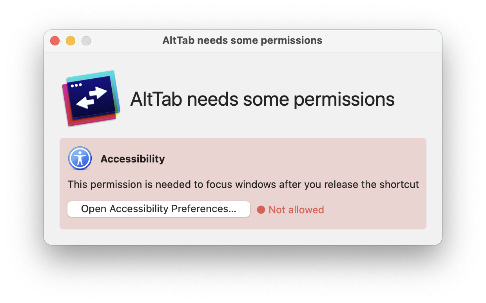
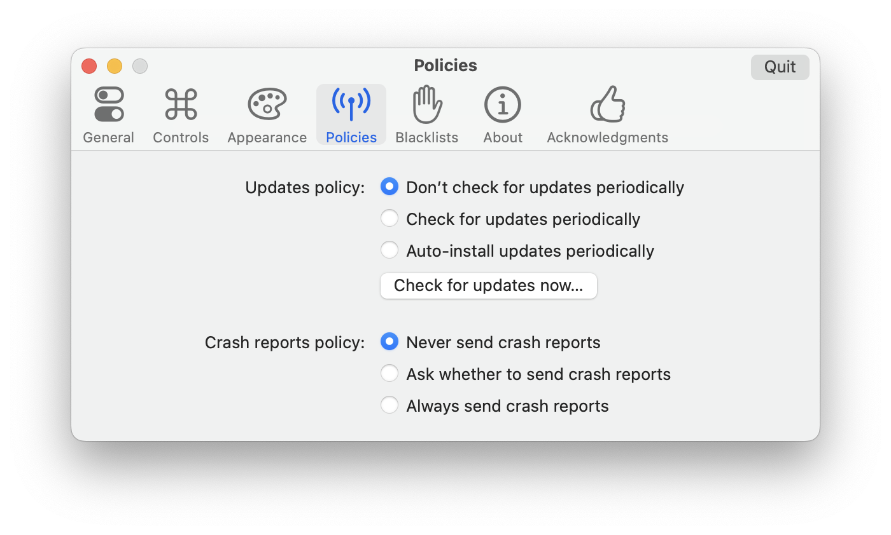

# AltTab, but no Screen Recording

> A fork of AltTab, but with the Screen Recording permission, and capabilities ripped out. 

## Why? 

It been long [standing feature request](https://github.com/lwouis/alt-tab-macos/issues/1082) that an option to run AltTab without screen recording permission is added, but it seems unlikely to be added to the official version as it would require a significant amount of engineering effort to make the permission optional, and the author has stated that they are not interested in adding this feature. What I have done is to simply remove the the screen recording permission requirement, and always return `nil` whenever a screenshot is requested. If you want or need the thumbnail functionality, you should use the official version.

There can be multiple reasons why you might want to run AltTab without the screen recording permissions. 

The first is if you don't need the functionality it provides, it's generally a best practice to not give an app more permissions than it needs, and while the code is open source, and I have no doubt that the author's intentions are good, it's better to be safe than sorry.

Secondly, you might be in a managed environment where you are not able to give the screen recording permission, and therefore unable to use AltTab. 

Thirdly, macOS is being increasingly annoying about the screen recording. Starting in Sonoma, an indicator would show up in the menubar whenever the screen recording feature was used even if thumbnails were disabled. In the Sequoia beta, several popups show whenever starting the computer from sleep mode complaining about the screen recording permissions. 

## Installation

### Binary
I might provide a binary if I figure out how signing works, but for now you have to build from source.

### Building from source

1. Delete AltTab.app if it's already installed. 
2. Remove AltTab from accessibility and screen recording permissions in `Settings>Privacy and Security`. Note, it's not sufficient to simply untoggle the permissions, you have to press the minus (-) button to completely remove the AltTab entry. 
3. Clone the repository.
4. Open the `alt-tab-macos.xcworkspace` file in xcode. 
5. You might have to change the signing to "Sign Locally to Run" if you go to the project settings by pressing the "alt-tab-macos" top level directory in the file tree. 
6. Build and run, and you should be able to set up Alt Tab without the screen recording permission. 

## Known limitations: 

- The update channel is still pointed at the official release of AltTab, so any updates will reintroduce the screenshot capabilities. 
- It seems the "Preview Selected Window" setting is broken. 
- The settings related to the thumbnails remain in the settings. 

Also, please dont't send feedback using the feedback window as it will go to the original AltTab repository. They should not be bothered with bugs introduced by me, so please disable crash reports also. 

## Maintainability

I do not have any experience developing for Apple's platforms, and I don't have a lot of time for maintaining the fork, but I do use it myself, so I will likely try to do enough to keep it working on my system, and share those changes here.

If you're interested in maintaining this or a separate fork with the same purpose, please let me know, and I can point to your fork instead.

## From Original Readme

**AltTab** brings the power of Windows alt-tab to macOS

[Find out more on the official website](https://alt-tab-macos.netlify.app/)
